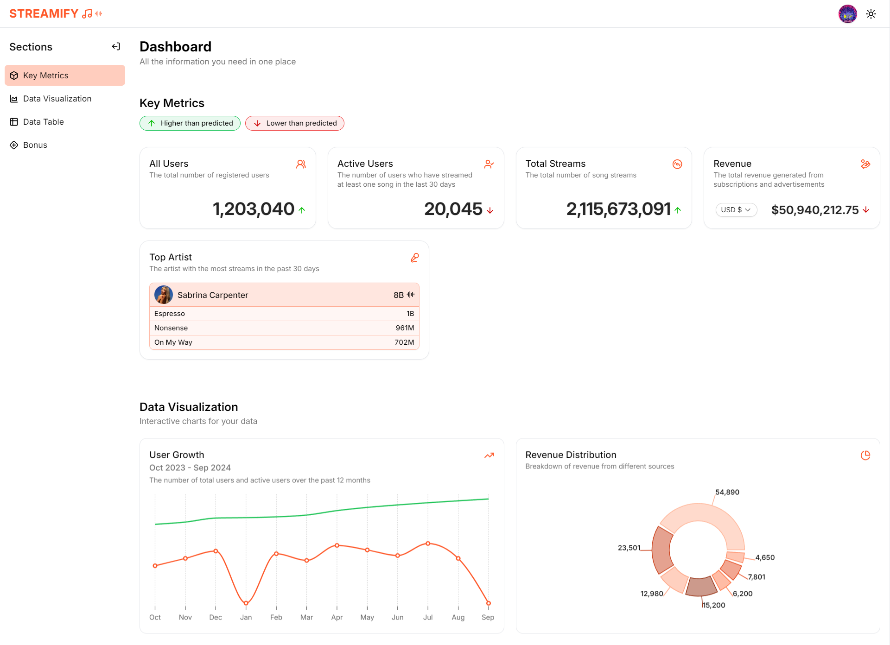

# Streamify Dashboard

### Overview
Assignment made for SpeedyBrand frontend engineer position.

[Visit](https://streamify-dashboard-indol.vercel.app/)

### Tech Stack
React + TypeScript + Vite + Tailwind

### Thought process 
-As you requested a SPA, I decided to utilize React to complete the assigment.
-All the data has been mocked and resides in the file DummyData.js
-The styling part was handled using Tailwind CSS and I also used some components from shadcn UI library.
-The charts and graphs are also made using a mix of libraries recharts.js and shadcn.
-The dashboard has been designed keeping in min modern UI practices. Clean, smooth and responsive.
-To improve performance I have utilized code splitting.
